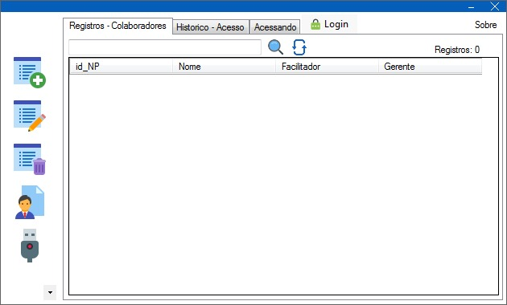
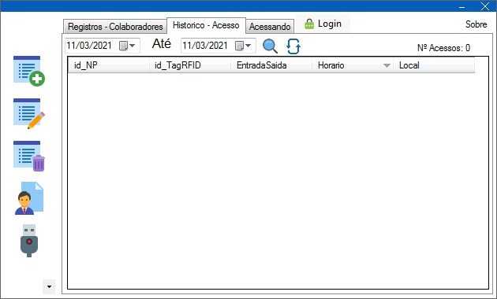
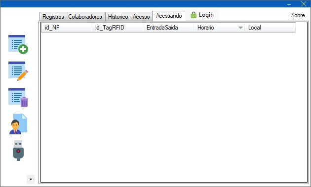

# Controle de Acesso por RFID

> O projeto concite em controlar o acesso de um determinado local, sendo o acesso liberado apenas para os funcionários que estão cadastrados no sistema.

## Requisito para rodar o código
Os componentes já citados no repositorio https://github.com/caiojj/controle_acesso_rfid também são requisitos para colocar o projeto em operação. O computador deve ter os seguintes software instalados.
- Visual Studio Community 
- Microsoft® SQL Server® Compact 4.0

## Video demonstrativo do projeto

https://www.youtube.com/watch?v=jrNVpYFj1XA&ab_channel=CaioJunior

## Interface Gráfica

### Registros dos colaboradores

### Historico geral de acesso

### Colaboradores que estão acessando o local

